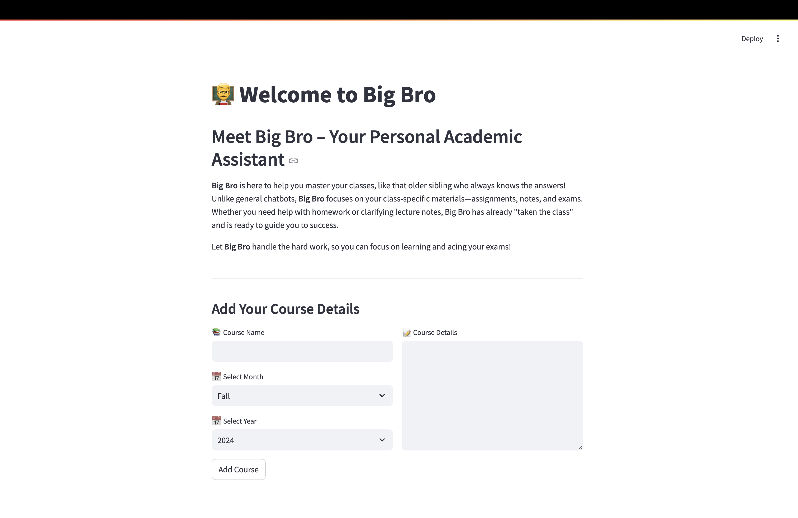

# Big Bro : Your Own Course Assistant

    

**Big Bro** is a personalized academic assistant designed to help students ace their classes. It's like having an older sibling who has already taken your classes and is ready to guide you through your coursework, assignments, and lecture notes. Powered by advanced language models, **Big Bro** understands your class materials and provides tailored help—whether it’s answering questions, helping with assignments, or clarifying concepts from your notes. This project is utilizing Retrieval-Augmented Generation (RAG) for answering questions based on course documents and helps organize that in a nice mannger. In this project, we are also using Ollama to create embeddings with the [nomic-embed-text](https://ollama.com/library/nomic-embed-text) to use with [Chroma](https://docs.trychroma.com/). Please note that the embeddings are reloaded each time the application runs, which is not efficient and is only done here for testing purposes.

---

## Features

- **Course-Specific Assistance**: **Big Bro** focuses on individual classes, with a separate chat history for each course. You can switch between classes seamlessly while preserving your previous chats.
- **Upload Class Materials**: You can upload files related to your courses (e.g., notes, assignments, lecture slides) and **Big Bro** will use them as part of its knowledge base.
- **Document Indexing**: Uploaded files are indexed using embeddings to enhance the understanding of your course materials.
- **Persistent Chat History**: Each course has its own independent chat history, allowing you to maintain separate conversations and revisit previous questions for each class.
- **Interactive Chat Interface**: Ask questions in a natural language, and **Big Bro** will provide detailed, course-specific answers.

---

## How It Works

1. **Add Courses**: Users can add their courses by entering the course name, details, and semester.
2. **Upload Files**: For each course, you can upload files like notes or assignments. These documents are indexed for more accurate responses.
3. **Chat With Big Bro**: Use the interactive chat interface to ask questions. **Big Bro** responds based on your course materials and general knowledge.
4. **Switch Between Courses**: Each course maintains its own chat history, allowing you to switch back and forth without losing your conversation.

    

## Requirements

- [Ollama](https://ollama.ai/) verson 0.1.26 or higher.

## Setup

1. Clone this repository to your local machine.
2. Create a Python virtual environment by running `python3 -m venv .venv`.
3. Activate the virtual environment by running `source .venv/bin/activate` on Unix or MacOS, or `.\.venv\Scripts\activate` on Windows.
4. Install the required Python packages by running `pip install -r requirements.txt`.

**Note:** The first time you run the project, it will download the necessary models from Ollama for the LLM and embeddings. This is a one-time setup.

## Running the Project

1. Ensure your virtual environment is activated.
2. Navigate to the directory containing the `app.py` script.
3. Run the Streamlit application by executing `streamlit run app.py` in your terminal.

This will start a local web server and open a new tab in your default web browser where you can interact with the application. The Streamlit UI allows you to select models, select a folder, providing an easier and more intuitive way to interact with the RAG chatbot system compared to the command-line interface. The application will handle the loading of documents, generating embeddings, querying the collection, and displaying the results interactively.

## Technologies Used

- [Langchain](https://github.com/langchain/langchain): A Python library for working with Large Language Model
- [Ollama](https://ollama.ai/): A platform for running Large Language models locally.
- [Chroma](https://docs.trychroma.com/): A vector database for storing and retrieving embeddings.
- [PyPDF](https://pypi.org/project/PyPDF2/): A Python library for reading and manipulating PDF files.
- [Streamlit](https://streamlit.io/): A web framework for creating interactive applications for machine learning and data science projects.
